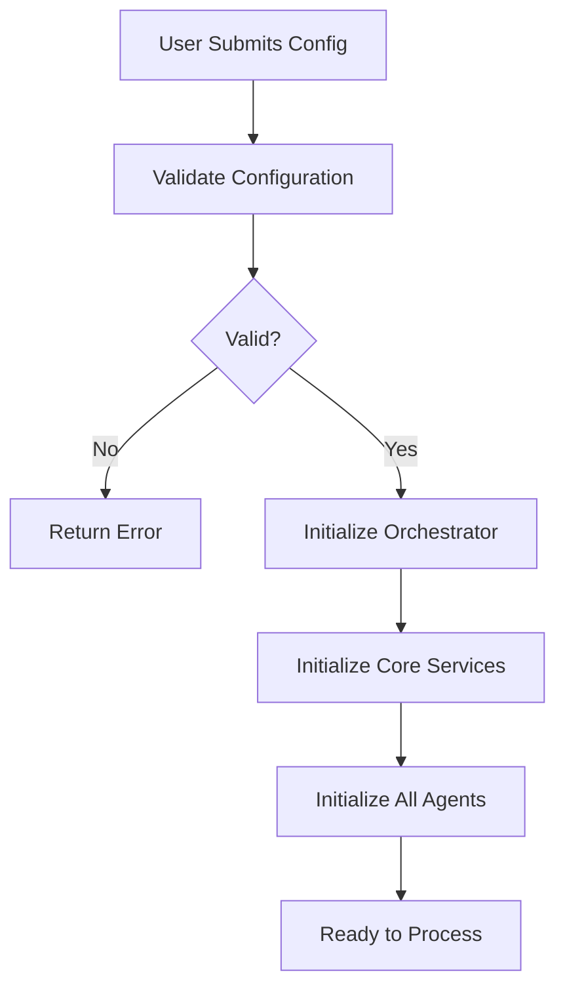

# Multi Agent Software Testing Team [MASTT] - Project Documentation


## 📚 Table of Contents

1. [Project Overview](#project-overview)
2. [Problem Statement](#problem-statement)
3. [Solution Architecture](#solution-architecture)
4. [Detailed Process Flow](#detailed-process-flow)
5. [Technical Implementation](#technical-implementation)
6. [Code Structure & Examples](#code-structure--examples)
7. [Agent System Design](#agent-system-design)
8. [RAG Implementation](#rag-implementation)
9. [API Documentation](#api-documentation)
10. [Conclusion](#conclusion)
11. [Future Enhancements](#future-enhancements)

---

## 1. Project Overview

### Vision
Create an intelligent, autonomous system that can analyze any software project and generate complete, production-ready test automation infrastructure with minimal human intervention.

### Objectives
- **Automate** the entire testing lifecycle from planning to implementation
- **Generate** production-quality test automation code
- **Ensure** comprehensive test coverage across all layers
- **Produce** complete documentation for maintainability
- **Reduce** testing setup time from weeks to hours

### Key Metrics
- **Time Savings**: 90% reduction in test automation setup time
- **Coverage**: 100+ test cases generated automatically
- **Quality**: Critic agents ensure high-quality outputs
- **Completeness**: All testing layers covered (API, DB, CLI, GUI)

---

## 2. Problem Statement

### Current State Challenges

#### Manual Testing Process
Traditional test automation setup requires:

1. **Code Analysis** (2-3 days)
   - Manually review codebase
   - Identify components to test
   - Understand architecture
   - Map dependencies

2. **Test Planning** (3-5 days)
   - Create test strategy
   - Define test types
   - Identify test scenarios
   - Plan resource allocation

3. **Test Case Writing** (1-2 weeks)
   - Write hundreds of test cases
   - Cover all scenarios
   - Document test data
   - Review and refine

4. **Framework Development** (2-3 weeks)
   - Design framework architecture
   - Implement base classes
   - Create utilities
   - Setup configurations

5. **Test Implementation** (3-4 weeks)
   - Implement API tests
   - Implement DB tests
   - Implement CLI tests
   - Implement GUI tests

6. **Documentation** (1 week)
   - Write setup guides
   - Document architecture
   - Create usage manuals
   - Write troubleshooting guides

**Total Time: 10-13 weeks minimum**

### Problems with Manual Approach

❌ **Time-Intensive**: Months of manual work  
❌ **Error-Prone**: Human mistakes in test cases  
❌ **Inconsistent**: Different quality across teams  
❌ **Incomplete**: Missing edge cases  
❌ **Expensive**: High resource cost  
❌ **Delayed**: Testing starts late in SDLC  

---

## 3. Solution Architecture

### High-Level Architecture

```
┌─────────────────────────────────────────────────────────────────┐
│                         USER INTERFACE                           │
│                     (React Web Application)                      │
└────────────────────────────┬────────────────────────────────────┘
                             │ HTTP/REST
                             ▼
┌─────────────────────────────────────────────────────────────────┐
│                      API LAYER (FastAPI)                         │
│  ┌────────────┐  ┌────────────┐  ┌─────────────┐               │
│  │ Project    │  │  Status    │  │  Results    │               │
│  │ Management │  │  Tracking  │  │  Delivery   │               │
│  └────────────┘  └────────────┘  └─────────────┘               │
└────────────────────────────┬────────────────────────────────────┘
                             │
                             ▼
┌─────────────────────────────────────────────────────────────────┐
│                    ORCHESTRATION LAYER                           │
│                   (Workflow Orchestrator)                        │
│  ┌──────────────────────────────────────────────────────────┐   │
│  │  Task Assignment │ Progress Tracking │ Context Management│   │
│  └──────────────────────────────────────────────────────────┘   │
└────────────────────────────┬────────────────────────────────────┘
                             │
         ┌───────────────────┼───────────────────┐
         │                   │                   │
         ▼                   ▼                   ▼
┌─────────────────┐ ┌─────────────────┐ ┌─────────────────┐
│  CORE SERVICES  │ │  AGENT LAYER    │ │  KNOWLEDGE BASE │
├─────────────────┤ ├─────────────────┤ ├─────────────────┤
│• Code Analyzer  │ │• PM Agent       │ │• RAG Engine     │
│• Doc Processor  │ │• Architect Agnt │ │• Vector DB      │
│• GitHub Tools   │ │• Test Writer    │ │• Embeddings     │
│• File Handlers  │ │• Auto Engineers │ │• Context Mgmt   │
└─────────────────┘ └─────────────────┘ └─────────────────┘
         │                   │                   │
         └───────────────────┼───────────────────┘
                             ▼
┌─────────────────────────────────────────────────────────────────┐
│                       OUTPUT GENERATION                          │
│   Test Plans │ Test Cases │ Automation Code │ Documentation     │
└─────────────────────────────────────────────────────────────────┘
```

### Component Breakdown

#### 1. User Interface Layer
- **Technology**: React 18
- **Purpose**: Provide intuitive interface for project configuration
- **Features**:
  - Project setup form
  - Real-time progress tracking
  - Results visualization
  - File download capabilities

#### 2. API Layer
- **Technology**: FastAPI
- **Purpose**: Handle HTTP requests and manage workflows
- **Endpoints**:
  - `POST /api/project/start` - Start new project
  - `GET /api/project/status` - Get progress status
  - `GET /api/project/results` - Get final results
  - `POST /api/project/feedback` - Submit user feedback
  - `GET /api/files/list` - List generated files
  - `GET /api/files/download/{path}` - Download files

#### 3. Orchestration Layer
- **Component**: WorkflowOrchestrator
- **Purpose**: Coordinate agent activities
- **Responsibilities**:
  - Initialize core services
  - Manage workflow stages
  - Provide context to agents
  - Store and retrieve results
  - Track progress
  - Handle errors

#### 4. Core Services

**Code Analyzer**
- Clones repositories (GitHub or local)
- Analyzes code structure
- Extracts complexity metrics
- Identifies test requirements
- Detects programming languages
- Maps API endpoints
- Finds database models

**Document Processor**
- Processes PDFs
- Reads Word documents
- Parses Markdown files
- Fetches Confluence pages
- Extracts requirements
- Identifies test scenarios
- Categorizes documents

**RAG Engine**
- Manages vector database
- Generates embeddings
- Retrieves relevant context
- Provides semantic search
- Supports agent queries

#### 5. Agent Layer

**11 Specialized Agents** (detailed below)

#### 6. Knowledge Base
- **Vector Database**: ChromaDB
- **Embeddings**: Google Generative AI Embeddings
- **Purpose**: Store and retrieve contextual information

---

## 4. Detailed Process Flow

### Phase 1: Initialization



**Steps**:
1. User provides project configuration
2. System validates inputs (API key, paths, etc.)
3. Orchestrator initializes with config
4. Core services are initialized:
   - Code Analyzer
   - Document Processor
   - RAG Engine
5. All 11 agents are initialized
6. System ready to process

### Phase 2: Analysis

```python
# Code Analysis Flow
def run_code_analysis():
    """
    1. Clone/access repository
    2. Scan directory structure
    3. Analyze files by type
    4. Extract functions, classes, APIs
    5. Calculate complexity metrics
    6. Identify test requirements
    7. Generate analysis report
    """
    
    analyzer = CodeAnalyzer(repo_path)
    
    # Prepare repository (clone if needed)
    local_path = analyzer.prepare_repository()
    
    # Analyze structure
    structure = analyzer.analyze_structure()
    # Returns: directories, files by type, languages
    
    # Analyze Python files specifically
    python_analysis = analyzer.analyze_python_files()
    # Returns: complexity, maintainability index, halstead metrics
    
    # Run multi-language analysis
    lizard_results = analyzer.analyze_with_lizard()
    # Returns: cyclomatic complexity, NLOC, function counts
    
    # Identify required test types
    test_types = analyzer.identify_test_types()
    # Returns: {backend: {api, db, cli}, frontend: {gui}, integration, e2e}
    
    return complete_analysis
```

```python
# Document Processing Flow
def run_document_processing():
    """
    1. Process local documents (PDFs, Word, Markdown)
    2. Fetch Confluence pages (if configured)
    3. Extract text content
    4. Chunk documents for RAG
    5. Generate embeddings
    6. Store in vector database
    """
    
    processor = DocumentProcessor()
    documents = []
    
    # Process each document type
    for doc_path in document_paths:
        if doc_path.endswith('.pdf'):
            doc = processor.process_pdf(doc_path)
        elif doc_path.endswith('.docx'):
            doc = processor.process_word_doc(doc_path)
        elif doc_path.endswith('.md'):
            doc = processor.process_markdown(doc_path)
        
        documents.append(doc)
    
    # Add to RAG engine
    rag_engine.add_documents(documents)
    
    return documents
```

### Phase 3: Test Planning

```python
def create_test_plan():
    """
    Architect Agent creates comprehensive test plan
    using code analysis and documentation context
    """
    
    # Get context from RAG
    context = orchestrator.get_context_for_agent(
        agent_type='architect',
        query='Create comprehensive test plan',
        include_code_analysis=True
    )
    
    # Architect creates plan
    test_plan = architect_agent.execute_task(
        {'type': 'create_test_plan'},
        context=context
    )
    
    # Critic reviews plan
    review = architect_critic.execute_task(
        {'test_plan': test_plan},
        context=context
    )
    
    # Revise if needed
    if review['review_status'] == 'needs_revision':
        revised_plan = architect_agent.revise_test_plan(
            test_plan,
            review['feedback'],
            context
        )
        return revised_plan
    
    return test_plan
```

### Phase 4: Test Case Writing

```python
def write_test_cases():
    """
    Test Case Writer creates detailed test cases
    for all categories
    """
    
    categories = ['api', 'database', 'cli', 'gui', 'integration', 'e2e']
    all_test_cases = {}
    
    for category in categories:
        # Get context including test plan
        context = orchestrator.get_context_for_agent(
            agent_type='test_case_writer',
            query=f'Write {category} test cases'
        )
        
        # Generate test cases
        test_cases = test_case_writer.write_category_test_cases(
            category,
            context
        )
        
        all_test_cases[category] = test_cases
    
    # Critic reviews
    review = test_critic.review_test_cases(
        all_test_cases,
        context
    )
    
    return all_test_cases, review
```

### Phase 5: Automation Framework

```python
def design_automation_framework():
    """
    Automation Architect designs complete framework
    """
    
    context = orchestrator.get_context_for_agent(
        agent_type='automation_architect',
        query='Design automation framework'
    )
    
    framework = automation_architect.execute_task(
        {'type': 'design_framework'},
        context=context
    )
    
    # Framework includes:
    # - Directory structure
    # - Base classes
    # - Configuration management
    # - Utilities
    # - Reporting setup
    # - CI/CD integration
    
    return framework
```

### Phase 6: Test Implementation

```python
def generate_automation_code():
    """
    Specialized agents generate automation code
    """
    
    automation_code = {}
    
    # API Automation
    automation_code['api'] = api_automation_agent.execute_task({
        'test_cases': test_cases['api'],
        'framework': framework
    })
    
    # DB Automation
    automation_code['db'] = db_automation_agent.execute_task({
        'test_cases': test_cases['database'],
        'framework': framework
    })
    
    # CLI Automation
    automation_code['cli'] = cli_automation_agent.execute_task({
        'test_cases': test_cases['cli'],
        'framework': framework
    })
    
    # GUI Automation
    automation_code['gui'] = gui_automation_agent.execute_task({
        'test_cases': test_cases['gui'],
        'framework': framework
    })
    
    return automation_code
```

### Phase 7: Documentation

```python
def generate_documentation():
    """
    Documentation Agent creates all docs
    """
    
    context = json.dumps(all_results)
    
    documentation = documentation_agent.execute_task(
        {'type': 'all'},
        context=context
    )
    
    # Generated documents:
    # - README.md
    # - INSTALLATION.md
    # - ARCHITECTURE.md
    # - USAGE.md
    # - DEBUGGING.md
    # - API_REFERENCE.md
    # - CONTRIBUTING.md
    # - CHANGELOG.md
    
    return documentation
```

---

## 5. Technical Implementation

### Google ADK Integration

```python
# Agent initialization with Gemini
import google.generativeai as genai

genai.configure(api_key=os.getenv('GOOGLE_API_KEY'))

model = genai.GenerativeModel(
    model_name='gemini-1.5-pro',
    generation_config={
        'temperature': 0.7,
        'max_output_tokens': 8192
    }
)

# Generate response
response = model.generate_content(prompt)
result = response.text
```

### RAG Implementation Details

```python
# Document indexing
from langchain.text_splitter import RecursiveCharacterTextSplitter
from langchain_google_genai import GoogleGenerativeAIEmbeddings
import chromadb

# 1. Initialize embeddings
embeddings = GoogleGenerativeAIEmbeddings(
    model="models/embedding-001"
)

# 2. Split documents
text_splitter = RecursiveCharacterTextSplitter(
    chunk_size=1000,
    chunk_overlap=200
)
chunks = text_splitter.split_text(document_text)

# 3. Generate embeddings
embeddings_list = embeddings.embed_documents(chunks)

# 4. Store in ChromaDB
collection.add(
    embeddings=embeddings_list,
    documents=chunks,
    metadatas=metadata_list,
    ids=chunk_ids
)

# Query for context
query_embedding = embeddings.embed_query(query_text)
results = collection.query(
    query_embeddings=[query_embedding],
    n_results=5
)
```

### Code Generation Strategy

Agents use a multi-step approach for code generation:

1. **Template Selection**: Choose appropriate code template
2. **Context Integration**: Incorporate project-specific information
3. **Pattern Application**: Apply design patterns (Page Object Model, etc.)
4. **Best Practices**: Follow language-specific conventions
5. **Validation**: Ensure syntax correctness
6. **Documentation**: Add docstrings and comments

Example generated code:

```python
# Generated by API Automation Agent
class BaseAPIClient:
    """Base API client with authentication and error handling."""
    
    def __init__(self, base_url: str, auth_token: Optional[str] = None):
        self.base_url = base_url
        self.session = requests.Session()
        if auth_token:
            self.session.headers.update({
                'Authorization': f'Bearer {auth_token}'
            })
    
    def get(self, endpoint: str, params: Optional[Dict] = None) -> requests.Response:
        """
        Execute GET request with retry logic.
        
        Args:
            endpoint: API endpoint path
            params: Query parameters
            
        Returns:
            Response object
        """
        url = f"{self.base_url}{endpoint}"
        response = self.session.get(url, params=params, timeout=30)
        response.raise_for_status()
        return response
```

---

## 6. Code Structure & Examples

### Project Structure

```
mastt/
├── agents/                      # AI Agents
│   ├── __init__.py
│   ├── base_agent.py           # Base class for all agents
│   ├── agent_prompts.py        # System prompts
│   ├── project_manager_agent.py
│   ├── architect_agent.py
│   ├── architect_critic_agent.py
│   ├── test_case_writer_agent.py
│   ├── test_critic_agent.py
│   ├── automation_architect_agent.py
│   ├── api_automation_agent.py
│   ├── db_automation_agent.py
│   ├── cli_automation_agent.py
│   ├── gui_automation_agent.py
│   └── documentation_agent.py
│
├── core/                        # Core utilities
│   ├── __init__.py
│   ├── code_analyzer.py        # Code analysis
│   ├── document_processor.py   # Document processing
│   ├── rag_engine.py          # RAG implementation
│   └── workflow_orchestrator.py # Workflow coordination
│
├── tools/                       # Custom tools
│   ├── __init__.py
│   ├── github_tools.py         # GitHub integration
│   ├── code_analysis_tools.py  # Code parsing
│   └── document_tools.py       # Document analysis
│
├── frontend/                    # React UI
│   ├── public/
│   │   └── index.html
│   ├── src/
│   │   ├── App.jsx
│   │   ├── App.css
│   │   ├── index.js
│   │   └── index.css
│   └── package.json
│
├── output/                      # Generated outputs
│   └── [project_name]/
│       ├── test_plans/
│       ├── test_cases/
│       ├── automation_code/
│       ├── documentation/
│       └── reports/
│
├── main.py                      # Main application
├── api_server.py               # FastAPI server
├── requirements.txt            # Python dependencies
├── package.json               # Node dependencies
├── setup.sh                   # Setup script
├── .env.example              # Environment template
├── .gitignore               # Git ignore
└── README.md               # Project readme
```

---

## 7. Agent System Design

### Agent Communication Pattern

```
User Request
     │
     ▼
Project Manager Agent
     │
     ├──> Task: Create Test Plan
     │    └──> Architect Agent
     │         ├──> Generates test plan
     │         └──> Returns to PM
     │
     ├──> Task: Review Test Plan
     │    └──> Architect Critic Agent
     │         ├──> Reviews plan
     │         ├──> Provides feedback
     │         └──> Returns to PM
     │
     ├──> Task: Revise (if needed)
     │    └──> Architect Agent
     │         └──> Revises based on feedback
     │
     └──> Continue workflow...
```

### Agent Base Class

All agents inherit from `BaseAgent`:

```python
class BaseAgent(ABC):
    """Base class for all AI agents."""
    
    def __init__(self, name, role, temperature=0.7):
        self.name = name
        self.role = role
        self.model = genai.GenerativeModel('gemini-1.5-pro')
        self.conversation_history = []
    
    @abstractmethod
    def get_system_prompt(self) -> str:
        """Return agent-specific system prompt"""
        pass
    
    def generate_response(self, prompt, context=None):
        """Generate response using Gemini"""
        full_prompt = f"{self.get_system_prompt()}\n\n"
        if context:
            full_prompt += f"Context: {context}\n\n"
        full_prompt += prompt
        
        response = self.model.generate_content(full_prompt)
        return response.text
    
    @abstractmethod
    def execute_task(self, task, context=None):
        """Execute specific task"""
        pass
```

---

## 8. RAG Implementation

### Why RAG?

RAG provides agents with:
- **Relevant Context**: Only necessary information
- **Semantic Search**: Find related content intelligently
- **Scalability**: Handle large documentation
- **Accuracy**: Ground responses in actual project data

### RAG Architecture

```
Documents → Text Splitting → Embedding Generation → Vector Storage
                                                            ↓
Query → Embedding → Similarity Search → Top K Results → Context
                                                            ↓
                                                    Agent Prompt
```

### Implementation

```python
class RAGEngine:
    def __init__(self):
        self.embeddings = GoogleGenerativeAIEmbeddings()
        self.client = chromadb.PersistentClient()
        self.collection = self.client.get_or_create_collection()
        self.text_splitter = RecursiveCharacterTextSplitter(
            chunk_size=1000,
            chunk_overlap=200
        )
    
    def add_documents(self, documents):
        for doc in documents:
            chunks = self.text_splitter.split_text(doc['text'])
            embeddings = self.embeddings.embed_documents(chunks)
            self.collection.add(
                embeddings=embeddings,
                documents=chunks,
                metadatas=[doc['metadata']] * len(chunks)
            )
    
    def query(self, query_text, n_results=5):
        query_embedding = self.embeddings.embed_query(query_text)
        results = self.collection.query(
            query_embeddings=[query_embedding],
            n_results=n_results
        )
        return results
```

---

## 9. API Documentation

### REST Endpoints

#### Start Project
```
POST /api/project/start
Content-Type: application/json

{
  "project_name": "my_project",
  "repository_path": "/path/to/code",
  "repository_type": "local",
  "document_paths": ["./docs"]
}

Response:
{
  "status": "started",
  "message": "Project workflow started",
  "project_name": "my_project"
}
```

#### Get Status
```
GET /api/project/status

Response:
{
  "status": "running",
  "progress": 45,
  "current_phase": "Test Case Writing",
  "message": "Writing test cases..."
}
```

#### Get Results
```
GET /api/project/results

Response:
{
  "test_plan": true,
  "test_cases": true,
  "automation_framework": true,
  "api_automation": true,
  "output_directory": "./output/my_project"
}
```

---

## 10. Conclusion

### Achievements

✅ **Fully Automated**: End-to-end automation of testing lifecycle  
✅ **Multi-Agent System**: 11 specialized AI agents working in harmony  
✅ **Production Quality**: Generated code is ready to use  
✅ **Comprehensive**: All testing layers covered  
✅ **Intelligent**: RAG-powered context-aware responses  
✅ **User-Friendly**: Simple web interface  
✅ **Time-Saving**: 90% reduction in setup time  

### Impact

- **For Teams**: Faster delivery, consistent quality
- **For Projects**: Rapid testing adoption
- **For Quality**: Comprehensive coverage, fewer bugs
- **For Cost**: Significant resource savings

### Key Innovations

1. **Multi-Agent Collaboration**: First system to use 11 specialized agents for testing
2. **Complete Automation**: From code to deliverables without manual intervention
3. **Quality Assurance**: Built-in critic agents ensure output quality
4. **RAG Integration**: Context-aware intelligent responses
5. **Full Stack**: Covers all testing layers in single system

---

## 11. Future Enhancements

### Short Term (3-6 months)
- [ ] Add more programming language support (Ruby, Go, Rust)
- [ ] Integrate with JIRA for automated ticket analysis
- [ ] Add test execution engine
- [ ] Real-time collaboration features
- [ ] Visual test report dashboard

### Medium Term (6-12 months)
- [ ] Performance testing capabilities
- [ ] Security testing integration
- [ ] Mobile testing support (iOS/Android)
- [ ] API mocking capabilities
- [ ] Test data generation engine

### Long Term (12+ months)
- [ ] Machine learning for test optimization
- [ ] Self-healing tests
- [ ] Predictive test selection
- [ ] Visual regression testing
- [ ] Multi-project analytics

---

## 📞 Contact & Support

For questions, issues, or contributions, please refer to the main README.md file.

**Project Repository**: https://github.com/rajarajane97/MASTT__Multi-Agent-Software-Testing-Team
**Documentation**: See README.md  
**License**: MIT  

---

## 👤 Author

### Rajarajan Ezhumalai
#### Engineering Leader | AI | Automation Enthusiast
https://www.linkedin.com/in/rajarajanezhumalai/

---

**Last Updated**: December, 2025  
**Version**: 1.0.0  
**Status**: Prototype